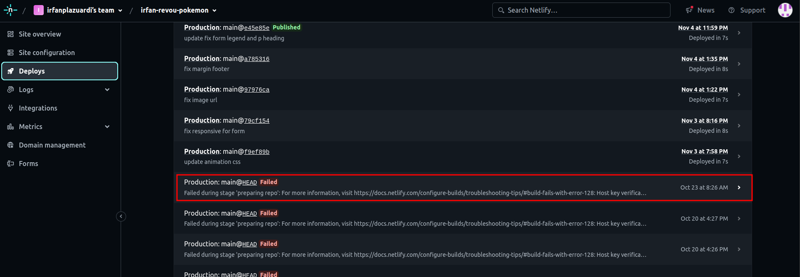

# About My Website

Hi, we are from Team Phoenix. We are looking for Pokemon Go trainers who would like to join our party and explore the world of Pokemon. By catching new Pokemon and collecting gym badges from challenging gym leaders around the world, we would like to help you boost your Pokemon level and achieve everything in Pokemon Go. So what are you waiting for? Come and join our party with Team Phoenix.
Visit our website [pokemonteamphoenix](https://pokemonteamphoenix.online)

# How to signup account with github and connect netlify auto deployment from github branch

1. Open [netlify](https://www.netlify.com/)
2. Click login
3. Select log in with github
4. Login to your github account
5. Click add new site
   
6. Select import an existing project

   

7. Click deploy with github
   
8. Select gtihub repository revou-fsse-3

   

9. Select project module-2-_student name_
   
10. Select the correct branch and click deploy _repository name_ at the bottom of the page
    

# Auto Deploy your website on Github with Netlify

After successfully connect your github project with netlify you now can auto deploy your website when ever the branch has been updated. To make sure your deployment is success you may need to check some deployment report on your project in netlify by following this steps:

1. Open [netlify](https://www.netlify.com/) and make sure account is login
2. Select your deployed site
   
3. Select deploys from the sidebar menu
4. It will show the deployment report make sure the status is published
   publish
   
   failed
   
5. Open your deployed website using the link located at the top of the page
   
6. Your webiste has been successfully deployed
   

# How to connect your custom domain and DNS

Now you are able to auto deploy your website using a domain from netlify. But how will you be able to deploy your own website using your own custom domain site. So here is the steps to connect custom domains with netlify:

## Purchase custom domain from domain host

1. Open [niagahoster](https://www.niagahoster.co.id/)
2. Click on Domain and select cari & cek domain
   
3. Input domain name and click cek sekarang
   
4. It will show domain options then select your domain by click pilih (_recommend the cheapest one for study purposes_)
   
5. Choose your payment method and and proceed payment by clicking buat tagihan pembayaran
   
6. After your payment is verified it will redirect to the domain setting board
   

## Set up cutom domain from netlify

1. Go to [netlify](https://www.netlify.com/) dashboard select site (_account must be login_)
2. Click setup up custom domain
   
3. Input your domain created from niagahoster
   
4. Click verify
5. Click continue
   
6. Copy all domain name servers and click done
   
7. Go back to [niagahoster](https://www.niagahoster.co.id/) domain setting board
8. Select DNS / Nameservers then click Change Nameservers
   
9. Paste the name servers from netlify in order from field 1-4
10. Click Save
    
11. Wait for a couple hours and make sure to check your domain frequently to make sure it is deployed
